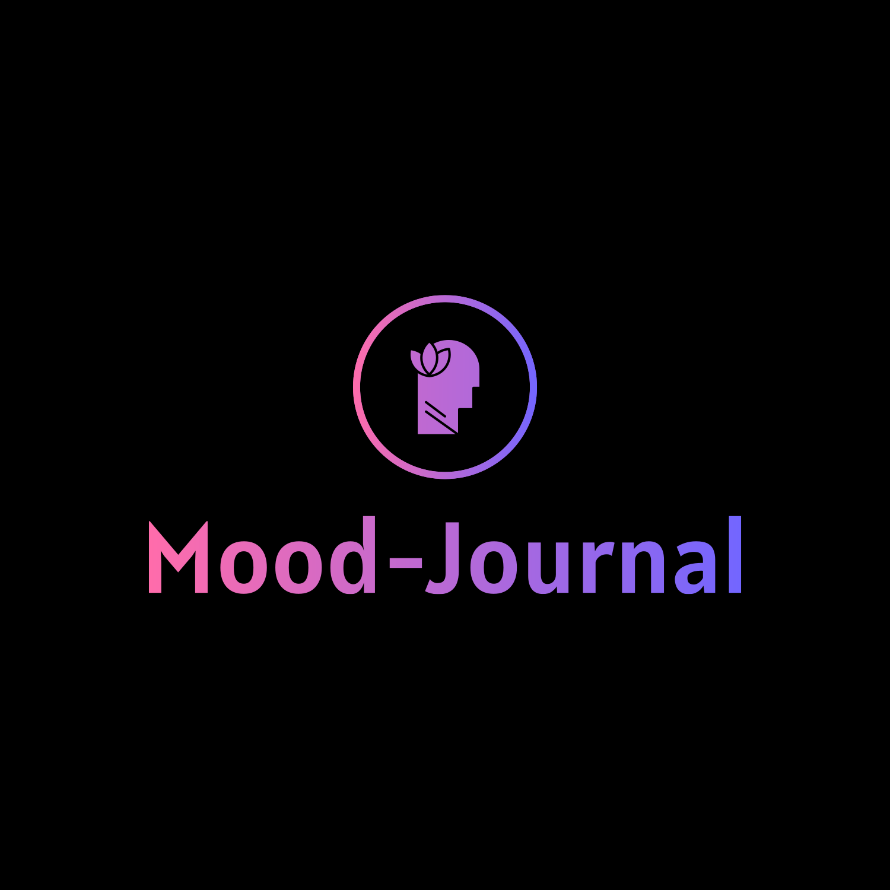

    
    <h1> Mood Journal </h1>

<h2>Table of Content</h2>
<ol>
    <li><a href="#subject1">What is Mood Journal?</a></li>
    <li><a href="#subject2">Technology Stack</a></li>
    <li><a href="#subject3">Project Structure</a></li>
    <li><a href="#subject4">Getting Started</a></li>
    <li><a href="#subject5">Deployment</a></li>
    <li><a href="#subject6">Testing</a></li>
    <li><a href="#subject7">API Documentation</a></li>
    <li><a href="#subject8">Contribution</a></li>
</ol>

<h1 id="subject1"> What is Mood Journal? </h1>

 Mood Journal is a Journaling Web application with some special features. It allows the user to write about their day in a classic diary format and then let the application know what their mood on that day was. After a specific number of entries the application analyses the text, and in combination with the mood level provided by the user for each entry, it draws a connection between specific words/phrases and a mood level. 

<h1 id="subject2">Technology Stack</h2>

This project uses the following technologies on the backend:

* [Java (SE 17)](https://openjdk.org/projects/jdk/17/)
* [Maven (version 4.0.0)](https://maven.apache.org/ref/4.0.0-alpha-9/)
* [Spring Boot (version 3.2.5)](https://docs.spring.io/spring-boot/docs/current/reference/html/getting-started.html)
* Spring Web
* Spring Data JPA
* Spring Security
* Lombok
* H2 
* Mockito
* MySQL

This project uses the following technologies on the frontend:

* NodeJS(version 20.11.1)
* Typescript
* ReactJS(version 18.3.1)
* Axios
* Tailwindcss(version 3.4.3)

<h1 id="subject3">Project Structure</h1>

<h1 id="subject4">Getting Started</h1>

<h1 id="subject5">Deployment</h1>

<h1 id="subject6">Testing</h1>

<h1 id="subject7">API Documentation</h1>

<h1 id="subject8">Contribution</h1>
